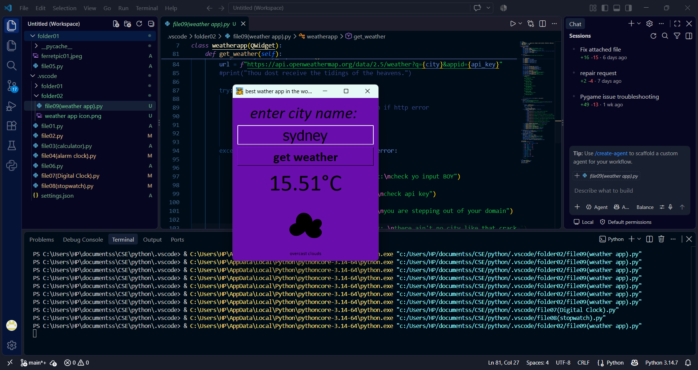

best-wather-app-in-the-world-mate

A compact, dark‑themed weather app that shows current conditions, hourly updates, and a 7‑day forecast. The project name intentionally stylizes "weather" as a playful brand choice.


  INDEX
- Features
- Tech Stack
- Installation
- Configuration
- Usage
- Screenshots and Demo
- Contributing


  FEATURES

- **Current weather** by city or geolocation  
- **Hourly forecast** and **7‑day forecast**  
- **Dark, mobile‑friendly UI** with responsive layout  
- Lightweight, dependency‑minimal frontend (HTML, CSS, JavaScript)

---

 TECH STACH

- **Frontend:** HTML, CSS, JavaScript  
- **API:** Weather provider (set API key in configuration)  
- **Optional tooling:** npm scripts for local dev if present

---


 INSTALLATION
 
```bash
git clone https://github.com/vyankteshgour-sudo/best-wather-app-in-the-world-mate.git
cd best-wather-app-in-the-world-mate
```

If the project uses Node tooling:
```bash
npm install
npm start
```

If the project is static, open `index.html` in your browser.

---


CONFIGURATION

Create a `.env` file in the project root or update your config file with the API key below. **Do not commit `.env` to version control.**

```env
WEATHER_API_KEY=2fd17f1979692b6744a34e9ed52fa2d5
```

If your app reads the key from a JS config file, add it to that file instead and ensure the file is listed in `.gitignore`.

---

 USAGES

- Open the app in your browser.  
- Search for a city or allow geolocation access to get local weather.  
- If data does not load, confirm the API key is valid and network requests are allowed.

---
 Screenshots and Demo

 
[Download or watch the screen recording](demovid-weatherapp.mp4)

 Contributing

- Fork the repo, create a feature branch, and open a pull request.  
- Keep commits focused and add tests or notes for UI changes.  
- Update this README if you change configuration or demo files.

-----END-------
